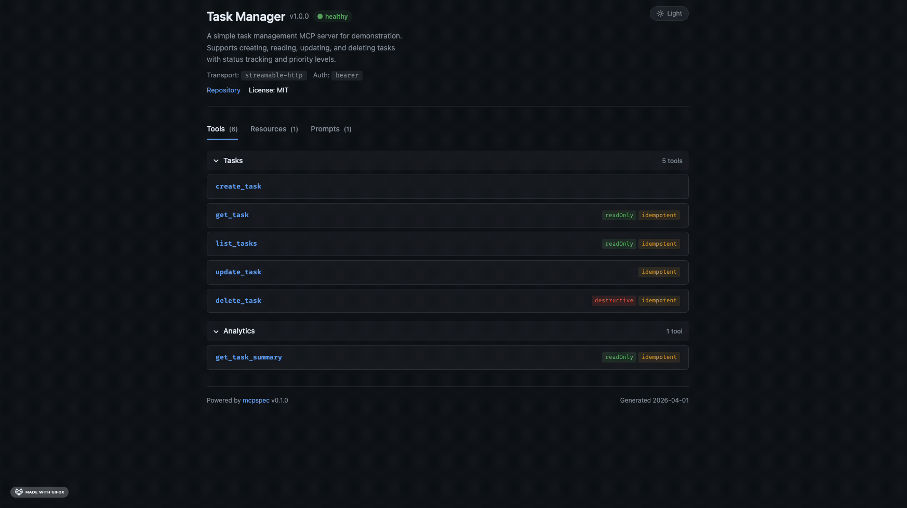

# mcpspec

Specs and interactive docs for MCP servers — like OpenAPI, but for the Model Context Protocol.

<p align="center">
  
</p>

mcpspec wraps your MCP server, introspects its tools, resources, and prompts via the MCP protocol, and serves:

- **`/docs`** — interactive HTML documentation (dark/light/high-contrast themes)
- **`/mcpspec.yaml`** — machine-readable spec in a standardized format
- **`/mcp`** — proxied MCP endpoint via Streamable HTTP

## Packages

| Package | Registry | Status | Docs |
|---------|----------|--------|------|
| [@mcpspec-dev/typescript](packages/typescript/) | [npm](https://www.npmjs.com/package/@mcpspec-dev/typescript) | Available | [README](packages/typescript/README.md) |
| [mcpspec-dev (Python)](packages/python/) | [PyPI](https://pypi.org/project/mcpspec-dev/) | Available | [README](packages/python/README.md) |

## Quick Start (TypeScript)

```bash
npm install @mcpspec-dev/typescript
```

```typescript
import { McpServer } from "@modelcontextprotocol/sdk/server/mcp.js";
import { mcpspec } from "@mcpspec-dev/typescript";

const server = new McpServer({ name: "my-server", version: "1.0.0" });

// Register your tools, resources, prompts as usual...

const app = mcpspec(server, {
  info: { title: "My MCP Server", version: "1.0.0" },
});

app.listen(3000);
// Docs:  http://localhost:3000/docs
// Spec:  http://localhost:3000/mcpspec.yaml
// MCP:   http://localhost:3000/mcp
```

For full API reference, configuration options, and composable `createHandler` usage, see the [TypeScript package docs](packages/typescript/README.md).

## How It Works

1. **Introspects** your MCP server at first request (lazy, cached)
2. **Generates** a `mcpspec.yaml` spec with tools, resources, prompts, and metadata
3. **Serves** human-readable docs and the raw spec as HTTP endpoints
4. **Proxies** MCP at `/mcp` so clients connect via Streamable HTTP

All introspection happens in-memory — mcpspec never touches the network or your auth layer.

## Security

mcpspec is a documentation tool, not a proxy.

- Only calls `tools/list`, `resources/list`, `prompts/list` — never reads content or executes tools
- Introspects via in-memory transport — bypasses HTTP/auth entirely
- Use `exclude`/`include` to control what appears in the spec

See [docs/guides/security.md](docs/guides/security.md) for details.

## Project Structure

```
mcpspec/
├── packages/typescript/       # @mcpspec-dev/typescript (npm)
├── packages/python/           # mcpspec-dev on PyPI
├── schema/                    # JSON Schema for mcpspec.yaml
├── docs-ui/                   # Docs HTML/CSS/JS source (bundled into package)
├── scripts/                   # Build scripts (docs-ui bundler)
├── examples/typescript/       # Example Task Manager server
├── docs/
│   ├── guides/                # Quickstart, configuration, security, spec format
│   └── architecture/          # Coding standards, quality gates, modularity
└── website/                   # mcpspec.dev (coming soon)
```

## Contributing

See [CONTRIBUTING.md](.github/CONTRIBUTING.md) for development setup, code standards, and PR process.

## License

[MIT](LICENSE)
